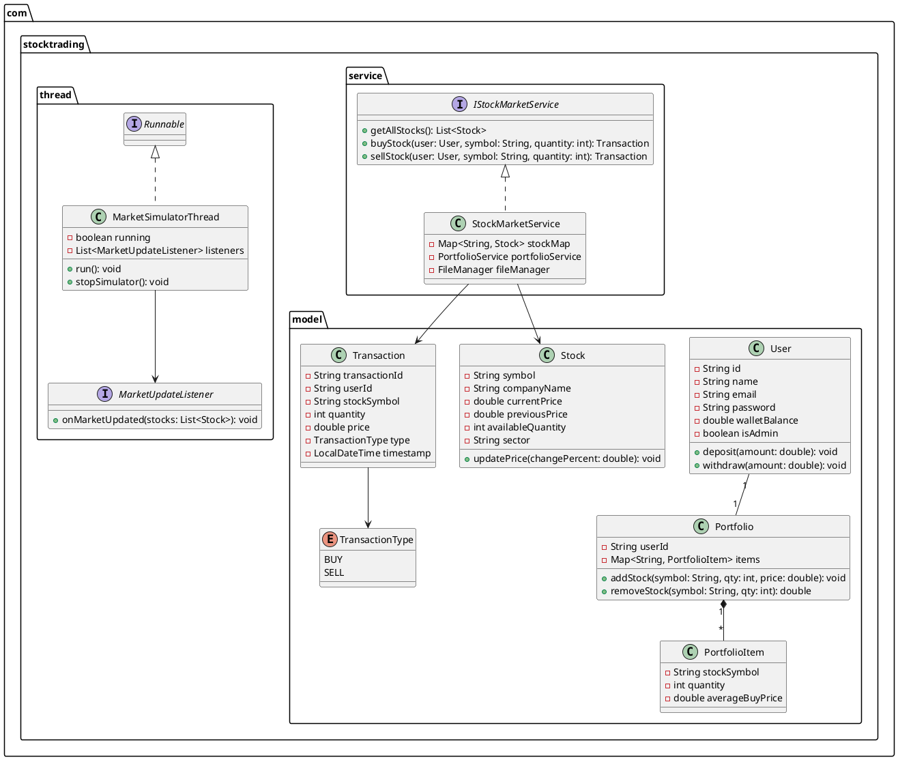

# UML Diagrams & System Architecture

This document contains the **UML Class Diagram**, **Activity Flowchart**, and **Sequence Diagram** for the Stock Trading Platform application.

---

## 1. Class Diagram (PlantUML)



---

## 2. Buy Stock Flowchart

```
[User Selects Stock in MarketPanel]
               │
               ▼
   [Enter Quantity & Click Buy]
               │
               ▼
  [Validate Quantity > 0 ?]
          /        \
       No/          \Yes
        ▼            ▼
[Show Error]    [Check Stock Available Qty >= Input]
                     /        \
                  No/          \Yes
                   ▼            ▼
           [Show Error]    [Check Wallet Balance >= Total Cost]
                                /        \
                             No/          \Yes
                              ▼            ▼
                      [Show Error]    [Execute Trade]
                                           │
                                           ├─► Deduct Wallet Balance
                                           ├─► Deduct Stock Quantity
                                           ├─► Add to User Portfolio
                                           ├─► Create Transaction Record
                                           └─► Save Data to File (.dat)
                                           │
                                           ▼
                                 [Show Success Dialog]
```

---

## 3. Market Simulator Sequence Diagram

```
MarketSimulatorThread        StockMarketService           MarketPanel (GUI)
       │                             │                            │
       │ (Loop every 10 seconds)     │                            │
       ├────────────────────────────►│                            │
       │ randomizePrices()           │                            │
       │                             ├─► Calculate -5% to +5%     │
       │                             ├─► Update Stock Prices      │
       │                             ├─► Save stocks.dat          │
       │                             │                            │
       │ onMarketUpdated(stocks)     │                            │
       ├─────────────────────────────────────────────────────────►│
       │                             │                            │ refreshTableData()
       │                             │                            │ SwingUtilities.invokeLater()
```
